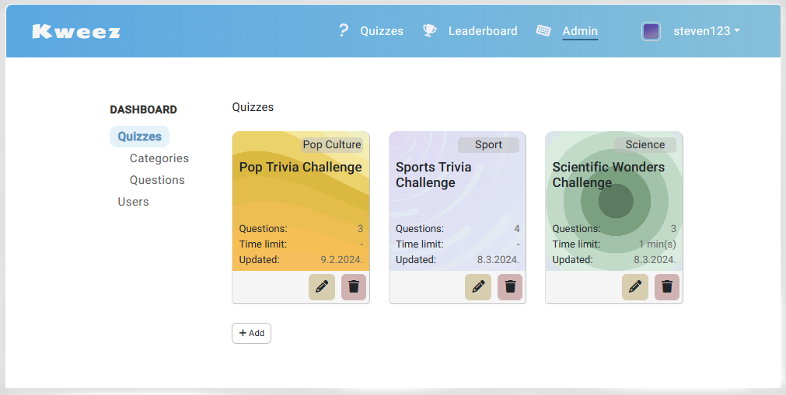

## Quiz web app

Create your own quiz and test your knowledge in various categories (or ask for help from your trusted AI advisor)

This is a simple quiz web app that I created as part of our class assignment (Advanced JavaScript Programming). The app was developed using the MEAN stack (MongoDB, Express, Angular and Node.js).

**Requirements**

Some of the requirements for this assignment were:
- at least three entities, not including users
- Angular routing, services, and pipes
- CRUD operations for at least one entity
- input validation
- different access rights and an administrative section
- authentication with tokens and hashed passwords
- RESTful API on the backend
- user interface implemented with a CSS library
- additional points - the app uses an external API and/or is deployed to a service provider

**Features**

I've implemented all the requirements above and added some extra features. The app is fully functional and includes complete administration capabilities. It also integrates the OpenAI API to assist confused quizzers in finding the right answers and to help admins generate new questions.

Additional trivial features:
- visitors can view quizzes and the leaderboard even if they are not registered (I didn't want to force registration)
- timed quizzes (if this were a production-grade, I would use a more thoughtful approach; currently, I only tried to prevent refresh from restarting the timer)
- variable number of questions (thought to add multiple correct choice questions)
- profile icons (without these, the app just looks dull)
- some SVG adapted backgrounds for a more interesting look and some random colors
- responsive
  
**Limitations**

- excluded public folder and .env files on the backend (if you want to try it yourself)
- weak backend checks (if any)
- easily hacked (but don't do it).
  
#
**Try it out**

- online: https://kveez.azurewebsites.net/
- locally: install Angular and Node.js dependencies with "npm install", compile the Angular code with "ng build --configuration=development", add .env files and start the Node.js server with "npm run dev" (note: quiz hints won't work without OpenAI API key).
